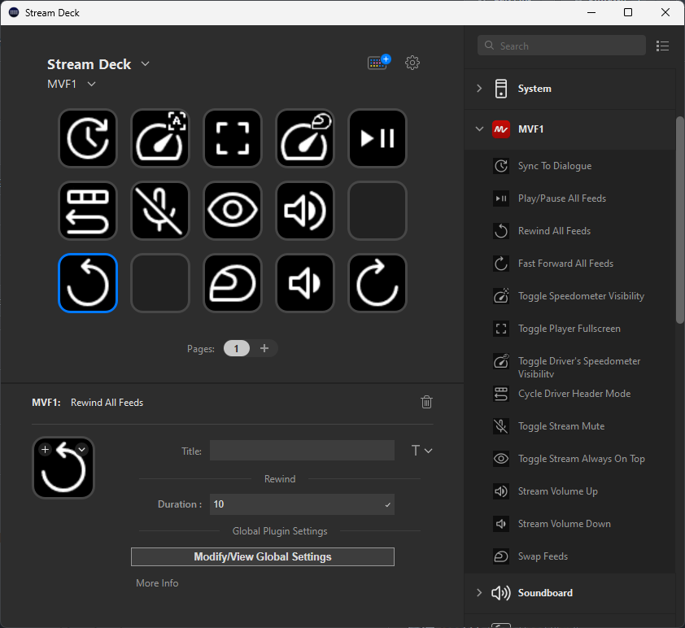

# MVF1 Streamdeck Plugin

Control [MultiViewer for F1](https://multiviewer.app) with your Stream Deck!

Supported actions include swapping driver cameras, full-screening specific feeds, muting and adjusting volumes of various feeds, force-syncing playback, and many more!

## Installation

Until this plugin gets added to the Elgato Store, we will need to head over to [releases](https://github.com/f1-tools/MVF1-Streamdeck/releases) and download the plugin. Additionally, we are experiencing an issue [with profile switching after the initial download](https://github.com/f1-tools/MVF1-Streamdeck/issues/1), so please check out that issue to ensure everything runs smoothly.

If you have any other issues you run into, please open an issue!

## Known Issues

### MVF1 Issues

- On first installation, the device fails to switch back to previous profile. For now, manually switch back to your main profile in the stream deck settings after the first time. It should work fine after that. #1
- Currently, having multiple devices connected at once does not work. If you want to use your phone to control, unplug your stream deck. #2
- #2
- Pause/Play does not pause/play Live Timing Data, but sync can. Issue on MVF1's side. #3
- Rewind/fast forward does not work in a live race - MVF1 limitation. #4

### Won't Fix

- When having multiple separate sessions streaming at once, things break... #5
- #8

### Investigating

- Non-toggle actions don't seem to be functional on mobile (driver swaps, volume up/down) #6
- Multiple devices can't be connected to stream deck at once. #2
- Profile installation issues and switching on initial install #1
- If only 2 streams and swap them, position is lost... #7
- Unfullscreening forgets always on top status. #8
- Cycle Driver header mode can remove driver header but breaks things after that #12 (temp: to fix swap driver stream with same stream)

### In Progress

- Main feed skips when swapping driver cams. #9

## Todo

- Error handling in API promises if stream deck launched before MVF1
- Driver swap for if all streams are already running (change which window is on top) #10
- Global setting to show/hide titles for drivers on their player cards
- Window arranging #11
- Analytics
- Speedometer and Data overlay settings and toggles
- States on buttons?
- Audio track, quality, and video settings
