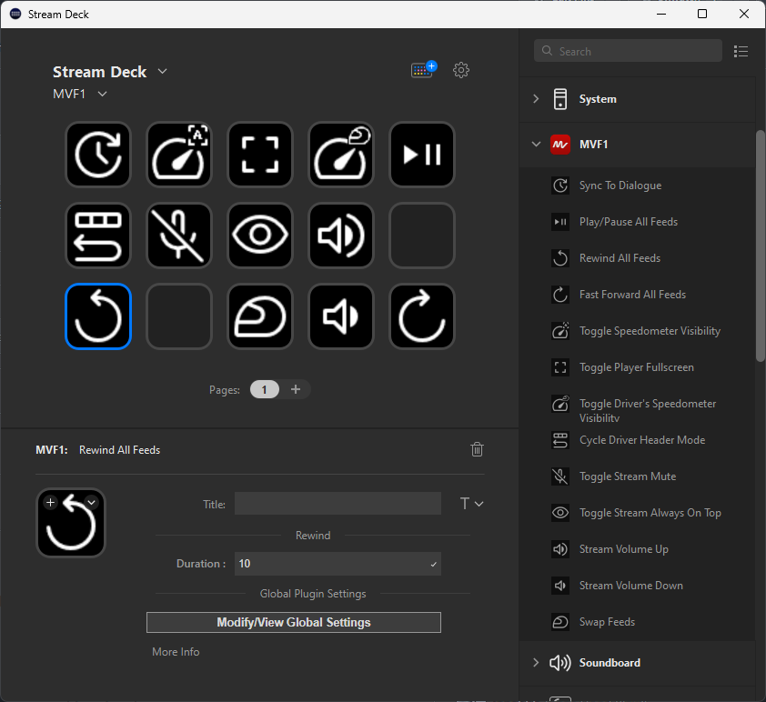

# MVF1 Streamdeck Plugin

Control [MultiViewer for F1](https://multiviewer.app) with your Stream Deck!

Supported actions include swapping driver cameras, full-screening specific feeds, muting and adjusting volumes of various feeds, force-syncing playback, and many more!

## Installation

Until this plugin is added to the Elgato Store, you must download it from [releases](https://github.com/f1-tools/MVF1-Streamdeck/releases).

If you run into any other issues, please open an issue!
